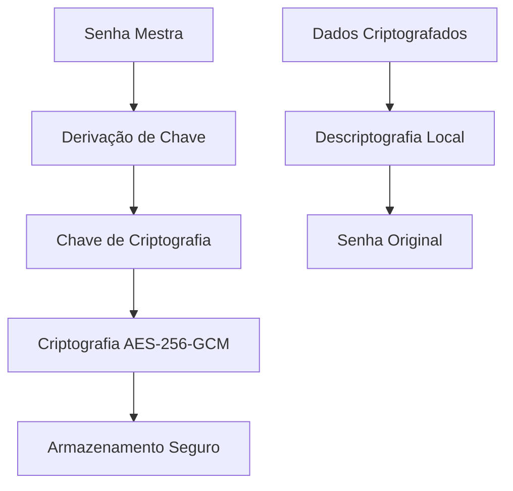

# 🔒 Segurança - FortiVault

Documentação completa sobre as implementações de segurança e melhores práticas do FortiVault.

## 🛡️ Arquitetura de Segurança

### Modelo de Segurança Zero-Knowledge

O FortiVault implementa um modelo de segurança zero-knowledge onde:
- ✅ Suas senhas são criptografadas localmente antes de serem armazenadas
- ✅ A senha mestra nunca é enviada para o servidor
- ✅ Nem mesmo os desenvolvedores podem acessar suas senhas
- ✅ Todo o processo de criptografia/descriptografia acontece no cliente



## 🔐 Implementações de Criptografia

### Criptografia Simétrica (AES-256-GCM)

```python
# backend/crypto_utils.py
from cryptography.hazmat.primitives.ciphers.aead import AESGCM
import os

class AdvancedCrypto:
    def encrypt(self, plaintext: str, key: bytes) -> dict:
        """
        Criptografia AES-256-GCM com autenticação
        """
        aesgcm = AESGCM(key)
        iv = os.urandom(12)  # 96-bit IV para GCM
        
        ciphertext = aesgcm.encrypt(
            iv, 
            plaintext.encode('utf-8'), 
            None  # AAD (Additional Authenticated Data)
        )
        
        return {
            'ciphertext': ciphertext.hex(),
            'iv': iv.hex(),
            'algorithm': 'AES-256-GCM'
        }
    
    def decrypt(self, encrypted_data: dict, key: bytes) -> str:
        """
        Descriptografia AES-256-GCM com verificação de integridade
        """
        aesgcm = AESGCM(key)
        
        ciphertext = bytes.fromhex(encrypted_data['ciphertext'])
        iv = bytes.fromhex(encrypted_data['iv'])
        
        plaintext = aesgcm.decrypt(iv, ciphertext, None)
        return plaintext.decode('utf-8')
```

### Hash de Senhas (Argon2id)

```python
from argon2 import PasswordHasher
from argon2.exceptions import VerifyMismatchError

class SecurePasswordManager:
    def __init__(self):
        self.ph = PasswordHasher(
            time_cost=3,        # Iterações
            memory_cost=65536,  # 64 MB de memória
            parallelism=1,      # Threads
            hash_len=32,        # Tamanho do hash
            salt_len=16         # Tamanho do salt
        )
    
    def hash_password(self, password: str) -> str:
        """Hash da senha usando Argon2id"""
        return self.ph.hash(password)
    
    def verify_password(self, password: str, hash: str) -> bool:
        """Verificar senha contra hash"""
        try:
            self.ph.verify(hash, password)
            return True
        except VerifyMismatchError:
            return False
```

### Derivação de Chaves (PBKDF2)

```python
from cryptography.hazmat.primitives.kdf.pbkdf2 import PBKDF2HMAC
from cryptography.hazmat.primitives import hashes
import os

def derive_key(master_password: str, salt: bytes = None) -> tuple[bytes, bytes]:
    """
    Deriva chave de criptografia da senha mestra
    """
    if salt is None:
        salt = os.urandom(32)
    
    kdf = PBKDF2HMAC(
        algorithm=hashes.SHA256(),
        length=32,  # Chave de 256 bits
        salt=salt,
        iterations=100000,  # 100k iterações
    )
    
    key = kdf.derive(master_password.encode('utf-8'))
    return key, salt
```

## 🔑 Autenticação e Autorização

### JWT (JSON Web Tokens)

```python
import jwt
from datetime import datetime, timedelta

class JWTManager:
    def __init__(self, secret_key: str):
        self.secret_key = secret_key
        self.algorithm = 'HS256'
    
    def create_access_token(self, user_data: dict) -> str:
        """Criar token de acesso"""
        payload = {
            'user_id': user_data['id'],
            'username': user_data['username'],
            'exp': datetime.utcnow() + timedelta(hours=1),
            'iat': datetime.utcnow(),
            'type': 'access'
        }
        
        return jwt.encode(payload, self.secret_key, algorithm=self.algorithm)
    
    def create_refresh_token(self, user_data: dict) -> str:
        """Criar token de atualização"""
        payload = {
            'user_id': user_data['id'],
            'exp': datetime.utcnow() + timedelta(days=30),
            'iat': datetime.utcnow(),
            'type': 'refresh'
        }
        
        return jwt.encode(payload, self.secret_key, algorithm=self.algorithm)
```

### Autenticação de Dois Fatores (2FA/TOTP)

```python
import pyotp
import qrcode
from io import BytesIO
import base64

class TwoFactorAuth:
    def __init__(self, issuer_name: str = "FortiVault"):
        self.issuer_name = issuer_name
    
    def generate_secret(self) -> str:
        """Gerar secret para 2FA"""
        return pyotp.random_base32()
    
    def generate_qr_code(self, username: str, secret: str) -> str:
        """Gerar QR code para configuração"""
        totp_uri = pyotp.totp.TOTP(secret).provisioning_uri(
            name=username,
            issuer_name=self.issuer_name
        )
        
        qr = qrcode.QRCode(version=1, box_size=10, border=5)
        qr.add_data(totp_uri)
        qr.make(fit=True)
        
        img = qr.make_image(fill_color="black", back_color="white")
        
        buffer = BytesIO()
        img.save(buffer, format='PNG')
        buffer.seek(0)
        
        return base64.b64encode(buffer.getvalue()).decode()
    
    def verify_totp(self, secret: str, token: str) -> bool:
        """Verificar código TOTP"""
        totp = pyotp.TOTP(secret)
        return totp.verify(token, valid_window=1)
    
    def generate_backup_codes(self, count: int = 10) -> list[str]:
        """Gerar códigos de backup"""
        import secrets
        return [
            f"{secrets.randbelow(10000):04d}-{secrets.randbelow(10000):04d}"
            for _ in range(count)
        ]
```

## 🛡️ Headers de Segurança

### Configuração do Next.js

```typescript
// next.config.mjs
const securityHeaders = [
  {
    key: 'X-DNS-Prefetch-Control',
    value: 'on'
  },
  {
    key: 'Strict-Transport-Security',
    value: 'max-age=63072000; includeSubDomains; preload'
  },
  {
    key: 'X-XSS-Protection',
    value: '1; mode=block'
  },
  {
    key: 'X-Frame-Options',
    value: 'DENY'
  },
  {
    key: 'X-Content-Type-Options',
    value: 'nosniff'
  },
  {
    key: 'Referrer-Policy',
    value: 'origin-when-cross-origin'
  },
  {
    key: 'Content-Security-Policy',
    value: `
      default-src 'self';
      script-src 'self' 'unsafe-eval' 'unsafe-inline';
      style-src 'self' 'unsafe-inline';
      img-src 'self' data: blob:;
      font-src 'self';
      object-src 'none';
      base-uri 'self';
      form-action 'self';
      frame-ancestors 'none';
      upgrade-insecure-requests;
    `.replace(/\s{2,}/g, ' ').trim()
  }
]
```

### Middleware de Segurança

```typescript
// middleware.ts
import { NextResponse } from 'next/server'
import type { NextRequest } from 'next/server'

export function middleware(request: NextRequest) {
  const response = NextResponse.next()
  
  // Rate Limiting básico
  const ip = request.ip || 'unknown'
  const rateLimitKey = `rate_limit_${ip}`
  
  // Headers de segurança
  response.headers.set('X-Frame-Options', 'DENY')
  response.headers.set('X-Content-Type-Options', 'nosniff')
  response.headers.set('Referrer-Policy', 'origin-when-cross-origin')
  
  // CSP para prevenir XSS
  response.headers.set(
    'Content-Security-Policy',
    "default-src 'self'; script-src 'self' 'unsafe-eval' 'unsafe-inline';"
  )
  
  return response
}
```

## 🔒 Segurança do Banco de Dados

### Configuração Segura do SQLite

```python
import sqlite3
from pathlib import Path

class SecureDatabase:
    def __init__(self, db_path: str):
        self.db_path = Path(db_path)
        self.db_path.parent.mkdir(parents=True, exist_ok=True)
        
        # Configurar permissões seguras
        self.db_path.chmod(0o600)  # Apenas proprietário pode ler/escrever
    
    def get_connection(self):
        conn = sqlite3.connect(
            self.db_path,
            timeout=30.0,
            isolation_level='IMMEDIATE',
            check_same_thread=False
        )
        
        # Habilitar WAL mode para melhor concorrência
        conn.execute('PRAGMA journal_mode=WAL')
        
        # Habilitar foreign keys
        conn.execute('PRAGMA foreign_keys=ON')
        
        # Configurar timeout para busy
        conn.execute('PRAGMA busy_timeout=30000')
        
        return conn
```

### Queries Parametrizadas

```python
class VaultDAO:
    def add_password(self, user_id: int, encrypted_data: dict):
        """Adicionar senha usando query parametrizada"""
        query = """
        INSERT INTO passwords (user_id, title, username, encrypted_password, 
                             created_at, updated_at)
        VALUES (?, ?, ?, ?, datetime('now'), datetime('now'))
        """
        
        with self.get_connection() as conn:
            conn.execute(query, (
                user_id,
                encrypted_data['title'],
                encrypted_data['username'],
                encrypted_data['password']
            ))
            conn.commit()
    
    def get_passwords(self, user_id: int) -> list:
        """Obter senhas do usuário"""
        query = """
        SELECT id, title, username, encrypted_password, created_at, updated_at
        FROM passwords 
        WHERE user_id = ? AND deleted = 0
        ORDER BY updated_at DESC
        """
        
        with self.get_connection() as conn:
            cursor = conn.execute(query, (user_id,))
            return cursor.fetchall()
```

## 🔐 Segurança da API

### Rate Limiting

```python
from fastapi import HTTPException, Request
from collections import defaultdict
from datetime import datetime, timedelta
import asyncio

class RateLimiter:
    def __init__(self):
        self.requests = defaultdict(list)
        self.limits = {
            '/auth/login': (5, 900),      # 5 tentativas em 15 min
            '/auth/register': (3, 3600),  # 3 tentativas em 1 hora
            'default': (60, 60)           # 60 requisições por minuto
        }
    
    async def check_rate_limit(self, request: Request, endpoint: str):
        client_ip = request.client.host
        key = f"{client_ip}:{endpoint}"
        
        now = datetime.now()
        limit, window = self.limits.get(endpoint, self.limits['default'])
        
        # Limpar requisições antigas
        self.requests[key] = [
            req_time for req_time in self.requests[key]
            if now - req_time < timedelta(seconds=window)
        ]
        
        # Verificar limite
        if len(self.requests[key]) >= limit:
            raise HTTPException(
                status_code=429,
                detail=f"Rate limit exceeded. Try again in {window} seconds."
            )
        
        # Adicionar requisição atual
        self.requests[key].append(now)
```

### Validação de Entrada

```python
from pydantic import BaseModel, validator, Field
import re

class PasswordEntryModel(BaseModel):
    title: str = Field(..., min_length=1, max_length=100)
    username: str = Field(..., min_length=1, max_length=100)
    password: str = Field(..., min_length=1, max_length=1000)
    url: str = Field(None, max_length=500)
    notes: str = Field(None, max_length=2000)
    
    @validator('title')
    def validate_title(cls, v):
        if not v.strip():
            raise ValueError('Title cannot be empty')
        return v.strip()
    
    @validator('url')
    def validate_url(cls, v):
        if v and not re.match(r'^https?://', v):
            raise ValueError('URL must start with http:// or https://')
        return v
    
    @validator('password')
    def validate_password_length(cls, v):
        if len(v) > 1000:  # Limite para dados criptografados
            raise ValueError('Password data too large')
        return v
```

## 🛡️ Segurança do Frontend

### Sanitização de Dados

```typescript
// lib/security.ts
import DOMPurify from 'dompurify'

export class SecurityUtils {
  static sanitizeHTML(dirty: string): string {
    return DOMPurify.sanitize(dirty, {
      ALLOWED_TAGS: [],
      ALLOWED_ATTR: []
    })
  }
  
  static sanitizeInput(input: string): string {
    return input
      .replace(/[<>]/g, '') // Remove < >
      .replace(/javascript:/gi, '') // Remove javascript:
      .trim()
  }
  
  static validatePassword(password: string): {
    isValid: boolean;
    errors: string[];
    strength: 'weak' | 'fair' | 'good' | 'strong';
  } {
    const errors: string[] = []
    
    if (password.length < 12) {
      errors.push('Deve ter pelo menos 12 caracteres')
    }
    
    if (!/[A-Z]/.test(password)) {
      errors.push('Deve conter pelo menos uma letra maiúscula')
    }
    
    if (!/[a-z]/.test(password)) {
      errors.push('Deve conter pelo menos uma letra minúscula')
    }
    
    if (!/\d/.test(password)) {
      errors.push('Deve conter pelo menos um número')
    }
    
    if (!/[^A-Za-z0-9]/.test(password)) {
      errors.push('Deve conter pelo menos um símbolo')
    }
    
    const strength = this.calculatePasswordStrength(password)
    
    return {
      isValid: errors.length === 0,
      errors,
      strength
    }
  }
  
  private static calculatePasswordStrength(password: string): 'weak' | 'fair' | 'good' | 'strong' {
    let score = 0
    
    if (password.length >= 12) score += 2
    if (password.length >= 16) score += 1
    if (/[A-Z]/.test(password)) score += 1
    if (/[a-z]/.test(password)) score += 1
    if (/\d/.test(password)) score += 1
    if (/[^A-Za-z0-9]/.test(password)) score += 2
    if (/(?=.*[A-Z])(?=.*[a-z])(?=.*\d)(?=.*[^A-Za-z0-9])/.test(password)) score += 1
    
    if (score >= 8) return 'strong'
    if (score >= 6) return 'good'
    if (score >= 4) return 'fair'
    return 'weak'
  }
}
```

### Proteção contra XSS

```typescript
// hooks/use-secure-storage.ts
export function useSecureStorage() {
  const setSecureItem = (key: string, value: any) => {
    try {
      // Validar key
      if (typeof key !== 'string' || key.length === 0) {
        throw new Error('Invalid storage key')
      }
      
      // Sanitizar value
      const sanitizedValue = typeof value === 'string' 
        ? SecurityUtils.sanitizeInput(value)
        : value
      
      localStorage.setItem(key, JSON.stringify(sanitizedValue))
    } catch (error) {
      console.error('Secure storage error:', error)
    }
  }
  
  const getSecureItem = (key: string) => {
    try {
      const item = localStorage.getItem(key)
      return item ? JSON.parse(item) : null
    } catch (error) {
      console.error('Secure storage error:', error)
      return null
    }
  }
  
  return { setSecureItem, getSecureItem }
}
```

## 🔍 Auditoria e Monitoramento

### Log de Auditoria

```python
import logging
from datetime import datetime
from typing import Optional

class AuditLogger:
    def __init__(self):
        self.logger = logging.getLogger('audit')
        self.logger.setLevel(logging.INFO)
        
        # Handler para arquivo
        handler = logging.FileHandler('audit.log')
        formatter = logging.Formatter(
            '%(asctime)s - %(levelname)s - %(message)s'
        )
        handler.setFormatter(formatter)
        self.logger.addHandler(handler)
    
    def log_action(self, 
                   user_id: int,
                   action: str,
                   resource: str,
                   resource_id: Optional[str] = None,
                   ip_address: str = 'unknown',
                   user_agent: str = 'unknown',
                   details: dict = None):
        """Log de ação do usuário"""
        
        log_entry = {
            'timestamp': datetime.utcnow().isoformat(),
            'user_id': user_id,
            'action': action,
            'resource': resource,
            'resource_id': resource_id,
            'ip_address': ip_address,
            'user_agent': user_agent,
            'details': details or {}
        }
        
        self.logger.info(f"AUDIT: {log_entry}")
        
        # Salvar no banco para consulta posterior
        self._save_to_database(log_entry)
```

### Detecção de Anomalias

```python
from collections import defaultdict
from datetime import datetime, timedelta

class AnomalyDetector:
    def __init__(self):
        self.user_patterns = defaultdict(list)
        self.suspicious_activities = []
    
    def analyze_login(self, user_id: int, ip_address: str, user_agent: str):
        """Analisar padrões de login"""
        now = datetime.utcnow()
        
        # Verificar IP novo
        user_ips = self.get_user_ips(user_id)
        if ip_address not in user_ips:
            self.flag_suspicious('new_ip_login', user_id, {
                'ip': ip_address,
                'timestamp': now.isoformat()
            })
        
        # Verificar múltiplos logins
        recent_logins = self.get_recent_logins(user_id, minutes=5)
        if len(recent_logins) > 3:
            self.flag_suspicious('multiple_logins', user_id, {
                'count': len(recent_logins),
                'timestamp': now.isoformat()
            })
    
    def flag_suspicious(self, activity_type: str, user_id: int, details: dict):
        """Marcar atividade suspeita"""
        self.suspicious_activities.append({
            'type': activity_type,
            'user_id': user_id,
            'details': details,
            'timestamp': datetime.utcnow()
        })
        
        # Notificar administrador se necessário
        if activity_type in ['multiple_failed_logins', 'data_exfiltration']:
            self.notify_admin(activity_type, user_id, details)
```

## 🚨 Resposta a Incidentes

### Procedimentos de Emergência

```python
class IncidentResponse:
    def __init__(self):
        self.incident_active = False
        self.lockdown_mode = False
    
    def trigger_lockdown(self, reason: str, admin_id: int):
        """Ativar modo de bloqueio"""
        self.lockdown_mode = True
        self.incident_active = True
        
        # Log crítico
        self.audit_logger.log_action(
            admin_id, 'security_lockdown', 'system',
            details={'reason': reason}
        )
        
        # Invalidar todas as sessões
        self.invalidate_all_sessions()
        
        # Notificar usuários
        self.notify_all_users('security_lockdown')
    
    def invalidate_all_sessions(self):
        """Invalidar todas as sessões ativas"""
        with self.get_db_connection() as conn:
            conn.execute(
                "UPDATE user_sessions SET is_valid = 0, "
                "invalidated_at = datetime('now')"
            )
            conn.commit()
    
    def quarantine_user(self, user_id: int, reason: str, admin_id: int):
        """Quarentena de usuário suspeito"""
        with self.get_db_connection() as conn:
            conn.execute(
                "UPDATE users SET is_quarantined = 1, "
                "quarantine_reason = ?, quarantined_at = datetime('now') "
                "WHERE id = ?",
                (reason, user_id)
            )
            conn.commit()
        
        # Log da ação
        self.audit_logger.log_action(
            admin_id, 'user_quarantine', 'user',
            resource_id=str(user_id),
            details={'reason': reason}
        )
```

## 📋 Checklist de Segurança

### ✅ Configuração Inicial

- [ ] Senhas fortes configuradas para todas as contas
- [ ] 2FA habilitado para todas as contas administrativas
- [ ] Firewall configurado (portas 8000, 3000, 8001)
- [ ] SSL/TLS configurado (produção)
- [ ] Headers de segurança implementados
- [ ] Rate limiting configurado
- [ ] Logs de auditoria ativos

### ✅ Monitoramento Contínuo

- [ ] Logs revisados regularmente
- [ ] Backups testados mensalmente
- [ ] Atualizações de segurança aplicadas
- [ ] Senhas alteradas conforme política
- [ ] Códigos de backup 2FA seguros
- [ ] Dispositivos não utilizados removidos

### ✅ Resposta a Incidentes

- [ ] Plano de resposta documentado
- [ ] Contatos de emergência atualizados
- [ ] Procedimentos de backup testados
- [ ] Canais de comunicação seguros
- [ ] Timeline de resposta definido

## 🛠️ Ferramentas de Segurança

### Análise de Vulnerabilidades

```bash
#!/bin/bash
# scripts/security-scan.sh

echo "🔍 Executando análise de segurança..."

# Scan de dependências Node.js
echo "📦 Verificando dependências frontend..."
npm audit --audit-level high

# Scan de dependências Python
echo "🐍 Verificando dependências backend..."
pip-audit

# Análise estática de código
echo "🔍 Análise estática..."
bandit -r backend/ -f json -o security-report.json

# Verificar configurações
echo "⚙️ Verificando configurações..."
./scripts/config-security-check.sh

echo "✅ Análise de segurança concluída!"
```

### Testes de Penetração

```bash
#!/bin/bash
# scripts/pentest.sh

echo "🎯 Iniciando testes de penetração..."

# Teste de força bruta
echo "🔓 Testando proteção contra força bruta..."
for i in {1..10}; do
  curl -X POST http://127.0.0.1:8000/auth/login \
    -H "Content-Type: application/json" \
    -d '{"username":"admin","password":"wrong'$i'"}'
  sleep 1
done

# Teste de rate limiting
echo "🚦 Testando rate limiting..."
for i in {1..100}; do
  curl -s http://127.0.0.1:8000/health > /dev/null &
done
wait

# Teste de headers de segurança
echo "🛡️ Verificando headers de segurança..."
curl -I http://localhost:3000 | grep -E "(X-Frame-Options|X-XSS-Protection|X-Content-Type-Options)"

echo "✅ Testes de penetração concluídos!"
```

## 📞 Contatos de Segurança

- 🚨 **Vulnerabilidades**: security@fortivault.com
- 🔒 **Bug Bounty**: bugbounty@fortivault.com
- 📧 **Incidentes**: incident-response@fortivault.com

---

**🔒 Segurança em primeiro lugar!** Mantenha-se sempre atualizado com as melhores práticas de segurança.
